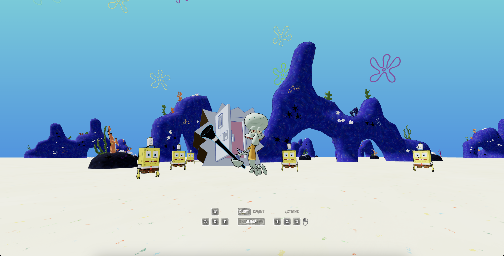

# SB-129

[](https://sb-129.com/)

Based off of [Pmndrs/ecctrl](https://github.com/pmndrs/ecctrl), play as Squidward as he finds himself trapped in a world he once called home. Made with [react-three-fiber](https://github.com/pmndrs/react-three-fiber) and [react-three-rapier](https://github.com/pmndrs/react-three-rapier).

You can play the game [here](https://sb-129.com/).

## Local Setup

Download [Node.js](https://nodejs.org/en/download). Run this followed commands:

```bash
# Install dependencies (only the first time)
npm install

# Run the local server at localhost:5173
npm run dev

# Build for production in the example/exampleDist/ directory
vite build -c vercelVite.config.js
```
